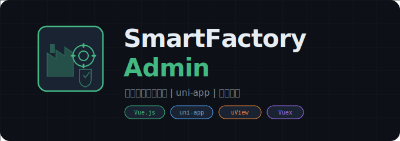

<div align="center">



<br/>
<br/>

**智工慧厂权限管理系统前端**

*uni-app 跨端开发 | Vue.js + uView UI | 多端适配*

[](https://vuejs.org/)
[](https://uniapp.dcloud.io/)
[](https://uviewui.com/)

</div>

---

## 概述

基于 uni-app 框架开发的权限管理系统前端，支持 H5、微信小程序、App 等多端适配。提供完整的用户认证、权限管理、通知公告、数据报表等功能模块。

### 功能模块

- **用户认证** -- 登录、注销
- **首页** -- 系统概览
- **应用管理** -- 用户管理、通知公告
- **数据报表** -- 数据可视化展示
- **个人中心** -- 个人资料、操作日志

### 多端支持

| 平台 | 状态 |
|:---|:---|
| H5 | 支持 |
| 微信小程序 | 支持 |
| 支付宝小程序 | 支持 |
| 百度/头条小程序 | 支持 |
| App (Android/iOS) | 支持 |

---

## 技术栈

| 组件 | 用途 |
|:---|:---|
| Vue.js 2.x | 前端框架 |
| uni-app | 跨端开发框架 |
| uView UI | UI 组件库 |
| Vuex | 状态管理 |

---

## 使用方法

### 环境要求

| 要求 | 说明 |
|:---|:---|
| Node.js | LTS 版本 |
| IDE | HBuilderX（推荐） |

### 安装

```bash
git clone https://github.com/Past-Tang/SmartFactory_Admin.git
cd SmartFactory_Admin
npm install
```

### 开发

```bash
npm run dev:h5          # H5 端
npm run dev:mp-weixin   # 微信小程序
```

### 构建

```bash
npm run build:h5          # H5 端
npm run build:mp-weixin   # 微信小程序
```

---

## 项目结构

```
SmartFactory_Admin/
├── api/                # 接口请求
├── components/         # 公共组件
├── config/             # 配置文件
├── pages/              # 页面
│   ├── center/         # 个人中心
│   ├── index/          # 首页
│   ├── login/          # 登录
│   ├── work/           # 应用管理
│   └── item/           # 数据报表
├── router/             # 路由配置
├── static/             # 静态资源
├── store/              # Vuex 状态管理
├── uni_modules/        # uni-app 模块 (uView UI)
├── utils/              # 工具函数
├── App.vue             # 入口组件
├── main.js             # 入口 JS
├── manifest.json       # 应用配置
└── pages.json          # 页面配置
```

---

## 注意事项

- H5 端开发配置在 `vue.config.js` 中调整
- 小程序开发需在 `manifest.json` 中配置对应 AppID